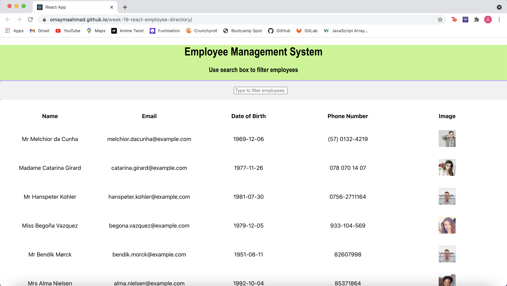

# week-19-react-employee-directory

### What it does:

* Using the table of random users generated from the [Random User API](https://randomuser.me/), a table of employees is rendered to the user.

* User is able to sort and filter the table by Name category.

* User can search for an employee by their name.

## Technology Used

* React

* Node.js 

* package.JSON

* gitignore

* Javascript

## Links

* [GitHub repository](https://github.com/omaymaahmad/week-19-react-employee-directory) 

* [Deployed Link](https://omaymaahmad.github.io/week-19-react-employee-directory/) 

* [My GitHub](https://github.com/omaymaahmad)  

* My Email: <omayma.ahmad25@gmail.com>

## Screenshot of Application

